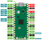

# Raspberry Pi Pico Logic Analyzer

This repository contains firmware for Raspberry Pi Pico Logic Analyzer.
Logic Analyzer uses modified PulseView https://github.com/ela-project/ela-pulseview.

Compiled binary file can be foud here:
 - https://github.com/ela-project/ela-fw-pico/releases

## Compilation
```bash
git submodule update --init
mkdir build
cd build
cmake ..
cmake --build .
```

## Pinout
